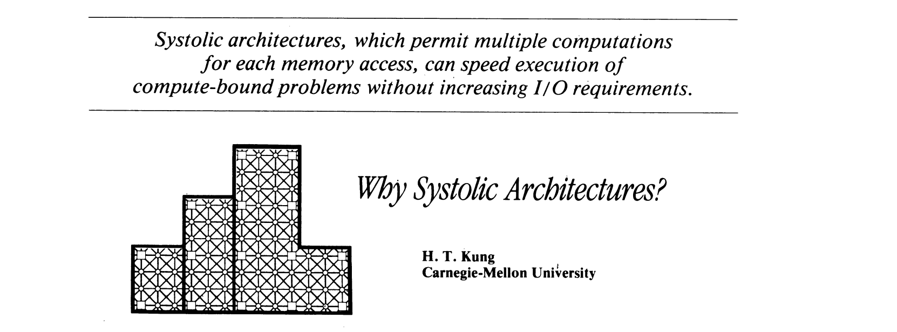

To better understand the architecture of the **Tensor Processing Unit (TPU)**, I decided to start with *Systolic Architecture*.  
The paper I will review is **"Why Systolic Architectures?"** by *H. T. Kung*.

The paper first highlights that high-performance, special-purpose computer systems are typically built on an **ad hoc** basis, resulting in a lack of systematic methodologies.   
To address these limitations, it proposes **systolic architecture** as a general guideline for designing such systems.

A **systolic architecture** has several key features:  
- Data flows from memory, passing through multiple processing units before returning to memory.  
- It can be two-dimensional.  
- Data flows at multiple speeds and in multiple directions, unlike classical pipelined systems.  
- **Regularity** makes it easy to implement.  
- **Modularity** allows for easy reconfiguration.  

To understand why systolic architecture is a general solution, we must first examine the key issues in designing special-purpose systems.

### **Key Architectural Issues in Designing** Special-Purpose Systems 
1. Simple and Regular Design  
   - Special-purpose systems must be cost-effective, with low design costs.  
   - Using simple, repetitive structures reduces complexity and improves scalability.  

2. Concurrency and Communication
   - Faster computation is achieved through concurrency rather than faster individual components.  
   - Algorithms should maximize parallelism using pipelining and multiprocessing.  

3. Balancing Computation with I/O 
   - System performance depends on balancing computation speed with I/O bandwidth.  
   - Overly fast processing without sufficient I/O capacity creates bottlenecks.  
   - Modular designs allow flexibility in adapting to different I/O bandwidth constraints.  

--- 

### **Basic Principle**
A **systolic system** consists of interconnected **processing cells**, where data flows in *a pipelined manner*, enabling *high computational throughput* without increasing memory bandwidth.  

1. **Regular Structure** - Processing elements (PEs) are arranged in a systolic array or tree, enabling simple and efficient communication.
2. **Compute-Bound vs. I/O-Bound Tasks**
   - Compute-bound tasks (e.g., matrix multiplication) benefit from systolic architectures because they perform multiple operations per data item.
   - I/O-bound tasks (e.g., matrix addition) are limited by memory bandwidth rather than computation speed.
3. **Memory as a Heart Analogy** - Data is pumped through the array like blood, ensuring efficient reuse of data items at each processing stage.
4. **High Throughput with Modest Memory Bandwidth** - The systolic approach maximizes computation by using each data element multiple times as it moves through the array.

---

### **Designs**
#### **B1 : Broadcast Inputs, Move Results, Weights Stay**
- Each weight (wi) is preloaded into a dedicated cell and remains static.
- Inputs (xi) are broadcast to all cells.
- Partial sums (yi) move from left to right through the array, accumulating results.
- Advantages:
   - No need for a global output network.
   - Regular, simple design.
- Disadvantages:
   - Requires wide systolic paths for moving partial sums, increasing complexity.

#### **B2 : Broadcast Inputs, Move Weights, Results Stay**
- Inputs (xi) are broadcast to all cells.  
- Weights (wi) move through the array.  
- Partial sums (yi) stay in place and accumulate results.  
- Advantages:  
  - Efficient use of multiplier-accumulator hardware.  
  - Requires narrower systolic paths compared to B1.  
- Disadvantages:  
  - Requires a global bus for collecting outputs.  

#### **F : Fan-in Results, Move Inputs, Weights Stay**  
- Weights (wi) are fixed in place.  
- Inputs (xi) move rightward through the array.  
- Each cell computes a multiplication, and results are fanned-in to an adder.  
- Advantages:  
  - Works well for large k (number of weights).  
  - Can utilize pipelined adder trees for speed.  
- Disadvantages:  
  - Fan-in logic adds complexity.  
  - Unbounded fan-in limits scalability.  

#### **R1 : Results Stay, Inputs and Weights Move in Opposite Directions**  
- Inputs (xi) move rightward, weights (wi) move leftward.  
- Each cell accumulates results at a stationary location.  
- Outputs move through a systolic output path.  
- Advantages:  
  - No global communication required.  
  - Efficient for multiplier-accumulator hardware.  
- Disadvantages:  
  - Only half the cells are active at a time.  
  - Requires a systolic output path.  

#### **R2 : Results Stay, Inputs and Weights Move in the Same Direction**  
- Inputs (xi) and weights (wi) move rightward, but at different speeds.  
- Weights stay longer in each cell before moving.  
- Advantages:  
  - All cells are active at all times, improving efficiency.  
  - Good for hardware multiplier-accumulators.  
- Disadvantages:  
  - Requires extra storage for weights in each cell.  

#### **W1 : Weights Stay, Inputs and Results Move in Opposite Directions**  
- Weights (wi) are preloaded and remain static.  
- Inputs (xi) move rightward; results (yi) move leftward.  
- Advantages:  
  - No need for a separate output path.  
  - Provides a constant response time.  
- Disadvantages:  
  - Only half of the cells are utilized at any given time.  

#### **W2 : Weights Stay, Inputs and Results Move in the Same Direction at Different Speeds**  
- Inputs (xi) and results (yi) both move rightward, but at different speeds.  
- Advantages:  
  - Ensures all cells are utilized throughout the computation.  
  - Suitable for 2D convolution extensions.  
- Disadvantages:  
  - Increases response time, as results take longer to compute.

---

### **Criteria and Advantages**
#### **(1) The design makes multiple use of each input data item** 
Systolic architectures *reuse input data* multiple times to reduce memory access. This improves efficiency and allows for *better performance without increasing memory bandwidth*.  

#### **(2) The design uses extensive concurrency**  
By *processing multiple operations in parallel* through pipelining and multiprocessing, systolic systems increase speed. Some designs also *overlap I/O and computation*, minimizing delays.  

#### **(3) There are only a few types of simple cells**  
Using *a few simple, repetitive cells* makes the design easier to build and cost-effective. More complex cells can add flexibility but may *increase design complexity*.  

#### **(4) Data and control flows are simple and regular**  
Data moves in a *fixed pattern between nearby cells*, avoiding long-distance connections. A *single system clock* keeps everything synchronized, making expansion straightforward.  

### **Insights**
> I/O and computation imbalance is notable ... fact that I/O interfaces cannot keep up with device speed is discovered only after constructing a high-speed, special purpose device.

This sentence reminds me of how critical the **I/O-bound bottleneck** can be. When I implemented an **MLP Neural Network Accelerator** for a college project, I encountered a similar issue—despite optimizing the computation, the system’s performance was ultimately limited by data transfer through the **I/O interfaces**. To work effectively on various **SoCs**, I need to explore different methodologies to mitigate this bottleneck.

> The challenge is to understand precisely the strengths and drawbacks of each design so that an appropriate design can be selected for a given ensironment.  

The paper suggests that systolic architecture could be a good solution for addressing **I/O bottlenecks** in SoC systems. I should analyze different designs to make the best choice.

> a problem that was originally compute-bound can become I/O-bound during its execution. ...  Systolic architectures, which ensure multiple computations per memory access, can speed up compute-bound computations without increasing I/O requirements.

I should be aware that something that is theoretically and computationally compute-bound can, in practice, become I/O-bound. Also, Systolic architecture seems to be a good approach for handling compute-bound tasks without adding extra I/O load. It might be a good option when dealing with a system that has fixed I/O.

> another level of pipelining by allowing the operations inside the cells themselves to be pipelined. ... building blocks can be programmed to form basic cells for a number of systolic systems.

I had not considered that complex building blocks might function as basic cells while also supporting pipelining. This makes me wonder if systolic architecture could be applied on a larger scale.

### **Reference**
H. T. Kung, *“Why Systolic Architectures?”* Computer, vol. 15, no. 1, pp. 37–46, Jan. 1982.