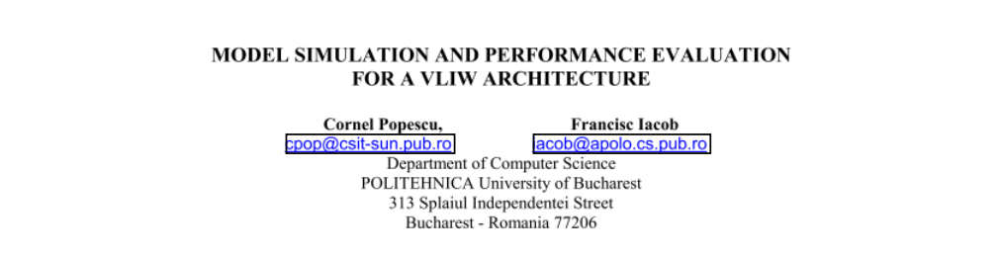

### Review

---

### Summary

---

### Insights

---

### Reference
Cornel Popescu and Francisc Iacob. Model Simulation and Performance Evaluation for a VLIW Architecture. *Department of Computer Science, POLITEHNICA University of Bucharest*