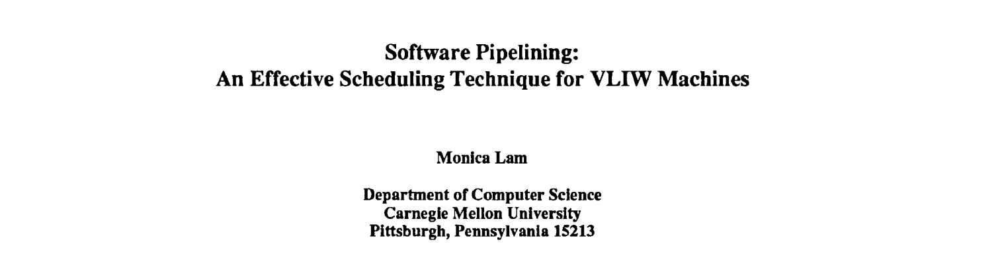

As I continue exploring VLIW processors, I have observed that exposing a sufficient level of Instruction Level Parallelism (ILP) is important to make effective use of their architectural characteristics. Most of the papers and textbooks I have consulted introduce trace scheduling as a primary compilation technique for uncovering ILP, which I plan to examine in more detail.

However, recently, I read a short retrospective article titled Retrospective: Software Pipelining – An Effective Scheduling Technique for VLIW Machines. In this piece, the author revisits her earlier work and argues that software pipelining can be effective on VLIW processors even without complex hardware mechanisms. To better understand this alternative scheduling approach, I decided to review the original paper, Software Pipelining: An Effective Scheduling Technique for VLIW Machines.



---
## The Basics

But before that, it is necessary to review the fundamentals of software pipelining in order to better understand the paper.

### **Software Pipelining**

**Software pipelining** is a loop scheduling technique that increases instruction-level parallelism by reorganizing loop execution such that each iteration of the transformed loop contains instructions drawn from multiple iterations of the original loop. By interleaving operations from different iterations, software pipelining separates dependent computations across a wider range of cycles—often by the length of an entire loop body—which reduces data hazards and increases the likelihood of producing a schedule free of stalls. This overlapping structure leads to more efficient use of hardware resources and significantly improves throughput. [3, 4]

#### Example [2]
- Before Software Pipelining (Original Loop):

  ```assembly
  Loop:   L.D     F0, 0(R1)      ; Load A[i]
          ADD.D   F4, F0, F2     ; A[i] + const
          S.D     F4, 0(R1)      ; Store back
          DADDUI  R1, R1, #-8    ; Move to A[i-1]
          BNE     R1, R2, Loop   ; Loop
  ```

- After Software Pipelining 

  ```assembly
  Loop:   S.D     F4, 16(R1)     ; Store A[i-2]
          ADD.D   F4, F0, F2     ; Add A[i-1] + const
          L.D     F0, 0(R1)      ; Load A[i]
          DADDUI  R1, R1, #-8    ; Move to A[i-1]
          BNE     R1, R2, Loop   ; Loop
  ```

- Each instruction comes from a different iteration (i, i-1, i-2).
- Overlapping iterations keeps the pipeline busy every cycle.
- Achieves one result per loop iteration → maximizes throughput.

---

### **Modulo Scheduling**

The commonly used technique to implement Software Pipelining is **Modulo Scheduling** [4].

The objective of modulo scheduling is to:
> **Assign a schedule to each instruction in a loop such that iterations can execute in an overlapped fashion—repeating every _Initiation Interval (II)_ cycles—without violating dependencies or exceeding resource limits.**

#### **Initiation Interval (II)**

- **II** is the number of cycles between the start of two consecutive loop iterations.
- A smaller II means more overlap and better throughput.
- Finding the **smallest possible II** that respects all constraints is the main goal.

#### **Scheduling Constraints**

1. Dependency Constraint
  - Instructions that depend on each other across loop iterations must be properly ordered.  
  For example, if instruction `A` produces a value needed by instruction `B` in a future iteration, we must ensure:
  - *Start(B) ≥ Start(A) + latency - distance × II*
  - **latency**: cycles it takes for A’s result to be ready  
  - **distance**: how many iterations ahead B is from A  
  - This ensures B never executes before A finishes.

2. Resource Constraint
  - At any cycle within the repeating loop of II cycles, resource usage must not exceed hardware limits.
  - For example:
    - If your hardware has only **one multiplier**, you can't schedule **two multiply instructions** in the same modulo II cycle.
  - This means:
    - For each type of hardware (ALU, multiplier, etc.), we must ensure no oversubscription.

#### **Scheduling Strategy**

1. Start with a small II (e.g., 1).
2. Try assigning cycle numbers to all instructions that:
   - Respect the dependency rule.
   - Stay within the hardware resource limits.
3. If no legal schedule is found, **increase II** and repeat.
4. When both constraints are satisfied, you've found a valid modulo schedule.

#### **Final Output**

Once a valid II is found:
- A **kernel** is constructed: a compact repeating sequence of scheduled instructions.
- This kernel is wrapped with:
  - **Prologue**: the pipeline warm-up phase.
  - **Epilogue**: the pipeline wind-down phase.
- The kernel is executed repeatedly, with new iterations starting every II cycles.

---

### **Software Pipelining vs. Loop Unrolling [3]**

**Software pipelining** can be viewed as a symbolic form of **loop unrolling** [3]. Some software pipelining algorithms even rely on unrolling techniques to help build efficient schedules.
Although both techniques aim to improve loop performance, they reduce different types of overhead.

#### **Loop Unrolling**

Loop unrolling reduces the overhead of loop control. This includes the time spent updating the loop counter and performing branch checks. By executing multiple iterations in one unrolled block, the number of times this overhead is paid is reduced.
For example, if a loop runs 100 times and is unrolled by a factor of 4, the loop control overhead is paid only 25 times instead of 100.
However, loop unrolling increases code size because it duplicates the loop body for each unroll.

#### **Software Pipelining**

Software pipelining improves performance by overlapping instructions from different iterations. It allows the loop to run closer to peak speed by avoiding idle cycles in the pipeline.
Instead of duplicating the loop body, software pipelining creates a compact kernel that repeats every few cycles. The overhead of filling and draining the pipeline is only paid once—at the beginning and end of the loop.
This makes software pipelining more space-efficient than loop unrolling.

#### **Why Use Both?**

Since loop unrolling and software pipelining target different types of inefficiencies, using them together can provide better results than using either one alone.
- Loop unrolling reduces how often loop control code runs.
- Software pipelining keeps the pipeline busy and avoids stalls.
When combined, these techniques can significantly improve the performance of inner loops, especially in performance-critical applications.
  
---

## Paper Review

---

### **Reference**
- **[1]** Monica S. Lam. 2003. *Retrospective: Software Pipelining – An Effective Scheduling Technique for VLIW Machines*. SIGPLAN Notices 39, 4 (April 2004), 244–256. ACM. https://doi.org/10.1145/989393.989420
- **[2]** Monica S. Lam. 1988. *Software Pipelining: An Effective Scheduling Technique for VLIW Machines*. In Proceedings of the ACM SIGPLAN '88 Conference on Programming Language Design and Implementation (PLDI '88), 318–328. https://doi.org/10.1145/960116.54022
- **[3]** John L. Hennessy and David A. Patterson. 2017. *Computer Architecture: A Quantitative Approach* (6th ed.). Morgan Kaufmann Publishers Inc., San Francisco, CA, USA.
- **[4]** Roel Jordans and Henk Corporaal. 2015. *High-level Software-Pipelining in LLVM*. In Proceedings of the 18th International Workshop on Software and Compilers for Embedded Systems (SCOPES '15), 97–100. https://doi.org/10.1145/2764967.2771935
- **[5]** Cornel Popescu and Francisc Iacob. 2000. *Model Simulation and Performance Evaluation for a VLIW Architecture*. *Journal of Electrical and Electronics Engineering*, vol. 1, no. 1.
