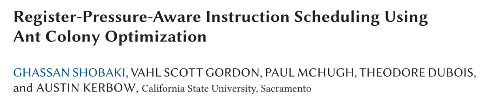

### Notes
#### 23:2
- Register Spilling -> indeed extra loads and stores
- Register Spilling is expensive on GPU:
  - What about VLIW processor with TPU?

#### 23:3
RP Estimation
- Peak Excess Register Pressure (PERP) [Shobaki et al. 2013] - CPU
- Sum of Live Interval lengths (SLIL) [Shobaki et al. 2019] - CPU
- Adjusted Peak Register Pressure (APRP) [Shobaki et al. 2020] - GPU

## Greedy Register Allocation in LLVM 3.0
### Basic Allocator
- On RISC architectures, explicit load and store instructions must be inserted.
- The basic allocator produces code very similar to linear scan's output, and it also depends on the virtual register rewriter to clean up the code for good results. It doesn't offer significant advantages over linear scan, and it is intended mostly for testing the framework of priority queues and live interval unions. The basic algorithm is very simple, and it offers many opportunities for tweaking. Greedy does just that.

### **Reference**
**[1]** Ghassan Shobaki, Vahl Scott Gordon, Paul McHugh, Theodore Dubois, and Austin Kerbow. 2022. Register-Pressure-Aware Instruction Scheduling Using Ant Colony Optimization. ACM Trans. Archit. Code Optim. 19, 2, Article 23 (June 2022), 23 pages. https://doi.org/10.1145/3505558